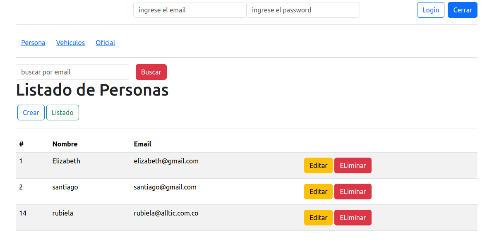
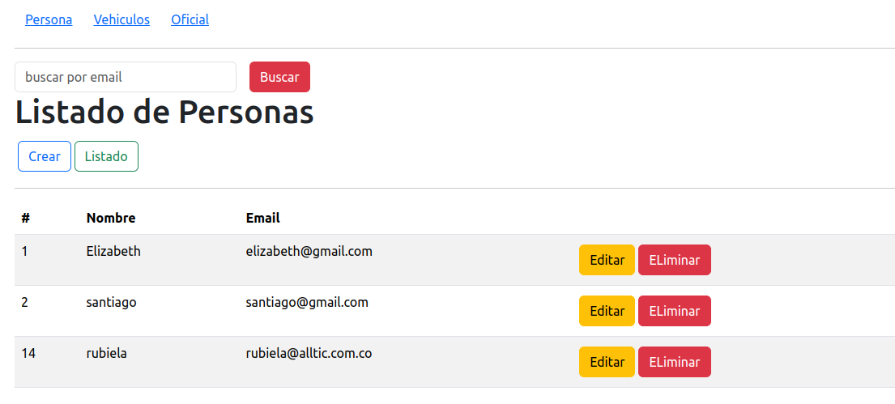
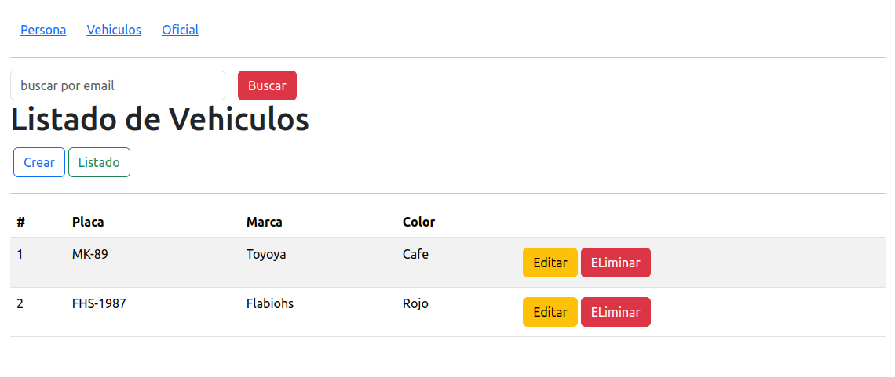
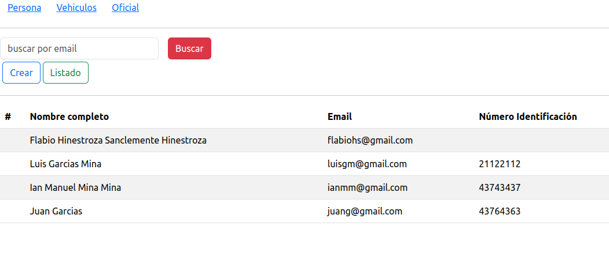
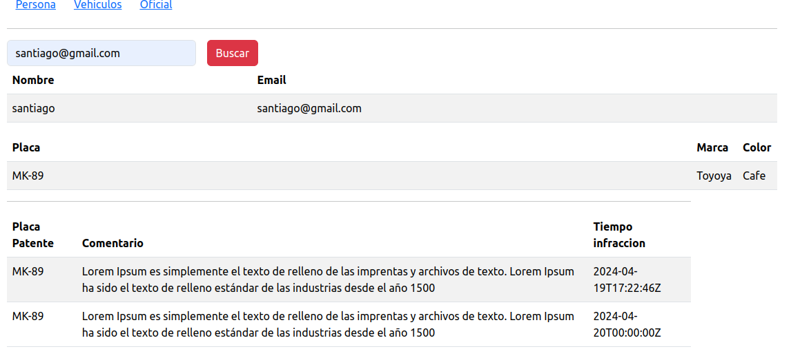

paso 1:
    yarn

paso 2:
   yarn dev

paso 3: 
   login
    ingresa con el email y password del oficial, y luego se muestre el link de infracción.
    

paso 4
   cada link o el menu muestra la información de cada uno de los servicios del backend
   
    persona:
    
    
    vehiculo:
     
    
    Oficial:
     
    
    Informe Genera:
    

paso 5:
    para el informe genera solo debe ingresar el email y muestrar el informe generar.